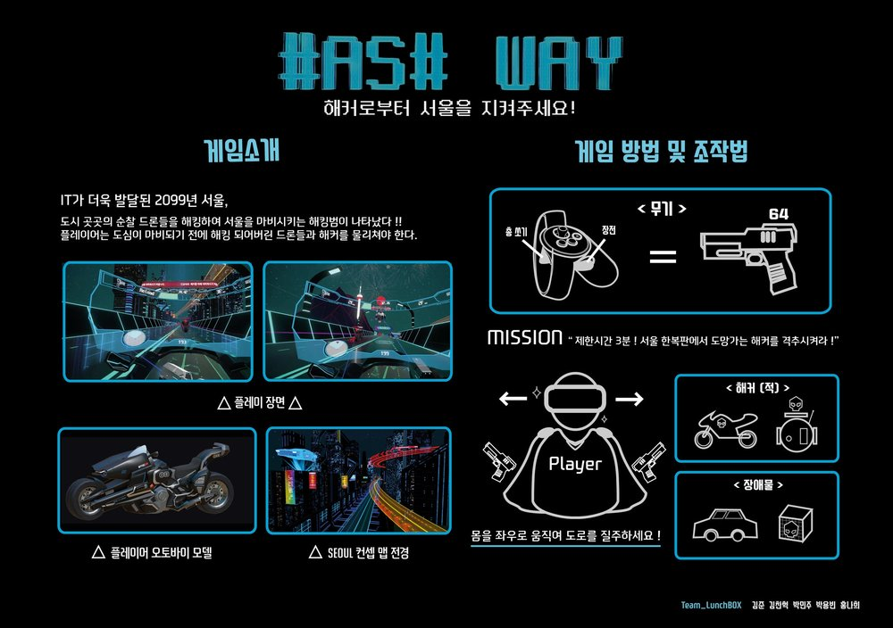

# HashWay

## Preview  
  

## One Page Game Design Document  

## Prototype  
<iframe width="425" height="239" src="https://www.youtube.com/embed/vxRCApVy5Bg" frameborder="0" allow="accelerometer; autoplay; encrypted-media; gyroscope; picture-in-picture" allowfullscreen></iframe>

## Alpha version    
<iframe width="425" height="239" src="https://www.youtube.com/embed/9q9vBKY4MCo" frameborder="0" allow="accelerometer; autoplay; encrypted-media; gyroscope; picture-in-picture" allowfullscreen></iframe>

## Beta 1.0    
<iframe width="425" height="239" src="https://www.youtube.com/embed/rc5oJxq9dXQ" frameborder="0" allow="accelerometer; autoplay; encrypted-media; gyroscope; picture-in-picture" allowfullscreen></iframe>

## Beta 2.0  
<iframe width="425" height="239" src="https://www.youtube.com/embed/IjGDH6ucHFI" frameborder="0" allow="accelerometer; autoplay; encrypted-media; gyroscope; picture-in-picture" allowfullscreen></iframe>

## Final Version     
<iframe width="425" height="239" src="https://www.youtube.com/embed/VC1bckCxxBw" frameborder="0" allow="accelerometer; autoplay; encrypted-media; gyroscope; picture-in-picture" allowfullscreen></iframe>

## Full Play   
<iframe width="883" height="496" src="https://www.youtube.com/embed/hDh0xV-HYXY" frameborder="0" allow="accelerometer; autoplay; encrypted-media; gyroscope; picture-in-picture" allowfullscreen></iframe>
